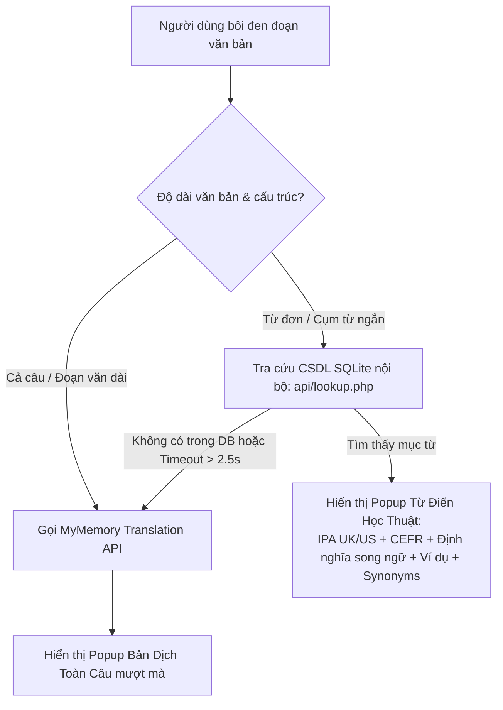

# TDict — Inline Selection Translator & Academic Dictionary Web Component

<p align="center">
  
  
  
  
  
  
  
</p>

**TDict** là một **Web Component / Widget nhúng** độc lập, siêu nhẹ, được thiết kế chuyên biệt để biến mọi website (blog cá nhân, cổng tài liệu kỹ thuật, trang tin tức, LMS học trực tuyến, nền tảng AI...) thành một môi trường **đọc hiểu tài liệu tiếng Anh liền mạch (Seamless In-place Reading & Lookup)**.

Người dùng chỉ cần **bôi đen từ hoặc câu**, popup giao diện sẽ lập tức xuất hiện ngay cạnh con trỏ chuột, cung cấp đầy đủ thông tin từ điển học thuật hoặc bản dịch câu mà **không cần chuyển tab, không cần cài extension, không làm gián đoạn mạch tư duy**.

---

## Trợ Thủ Đắc Lực Khi Học Tập, Nghiên Cứu AI & Đọc Tài Liệu Kỹ Thuật

Khi nghiên cứu Trí Tuệ Nhân Tạo (AI / Machine Learning / Deep Learning), đọc research papers (arXiv), tài liệu kỹ thuật (PyTorch, TensorFlow, LangChain, Hugging Face, OpenAI Docs) hay tài liệu Prompt Engineering:

- **Rào cản lớn nhất:** Thường xuyên bắt gặp các thuật ngữ chuyên môn sâu (*heuristic, stochastic, latent space, embedding, benchmark, gradient descent, perplexity, inference, hallucination...*).
- **Gây mất tập trung:** Phải copy từng từ, nhảy qua tab Google Dịch / từ điển ngoài làm đứt gãy luồng suy nghĩ (context switching).
- **Giải pháp với TDict:**
  - **Tra từ đơn chuyên sâu:** Bôi đen từ để xem ngay phát âm quốc tế IPA (cả giọng Anh UK lẫn Mỹ US), cấp độ từ vựng CEFR (từ A1 đến C2), từ loại, định nghĩa song ngữ Anh - Việt, ví dụ ngữ cảnh thực tế và các từ đồng nghĩa (synonyms).
  - **Dịch đoạn văn / câu Prompt phức tạp:** Bôi đen cả câu hoặc đoạn văn, TDict tự động kích hoạt cơ chế dịch thông minh để trả về bản dịch hoàn chỉnh tức thì.
  - **Luyện phát âm chuẩn:** Tích hợp nút phát âm qua file audio và công nghệ **Web Speech API** với giọng đọc tự nhiên (Natural US/UK Voice), hỗ trợ học chuẩn ngữ điệu của các thuật ngữ công nghệ.

---

## Thống Kê Cơ Sở Dữ Liệu SQLite (Được Kiểm Định)

Dữ liệu từ điển được lưu trữ cục bộ ngay trong thư mục `data/dictionary_en_vi.sqlite`, không phụ thuộc vào database server cồng kềnh, phản hồi siêu tốc (~5–15ms):

| Hạng mục | Số lượng / Tỷ lệ | Mô tả |
| :--- | :---: | :--- |
| **Tổng số từ vựng (Words)** | **7,101 từ** | Tuyển chọn từ vựng thông dụng, học thuật và chuyên ngành |
| **Tổng mục định nghĩa (Definitions)** | **8,138 mục** | Giải nghĩa song ngữ Anh – Việt chi tiết theo từng ngữ cảnh |
| **Phiên âm IPA UK & US** | **100% (7,101 từ)** | Đầy đủ phiên âm chuẩn Anh – Anh và Anh – Mỹ |
| **Câu ví dụ thực tế song ngữ** | **100% (8,138 mục)** | Đi kèm câu mẫu tiếng Anh và bản dịch tiếng Việt |
| **Phân cấp trình độ CEFR** | **100% (A1 → C2)** | Giúp người học đánh giá chính xác độ khó của từ |

### Phân Bổ Cấp Độ CEFR Trong Database:
```text
  A1 (Beginner)          : [891 từ]  12.5%
  A2 (Elementary)        : [1,067 từ] 15.0%
  B1 (Intermediate)      : [1,300 từ] 18.3%
  B2 (Upper-Intermediate): [1,947 từ] 27.4%
  C1 (Advanced)          : [1,338 từ] 18.8%
  C2 (Proficiency)       : [558 từ]   7.9%
```

---

## Cơ Chế Vận Hành Hybrid Thông Minh (Dual Engine)

TDict kết hợp hài hòa giữa **Cơ sở dữ liệu nội bộ (Local-first SQLite)** và **Dịch vụ dịch thuật đám mây (MyMemory Cloud API)**:



1. **Ưu tiên SQLite cục bộ:** Tra cứu từ/cụm từ Anh → Việt siêu tốc. Chuẩn hóa chữ hoa, khoảng trắng, dấu câu thông minh.
2. **Fallback tự động sang MyMemory:** Khi gặp câu dài hoặc từ hiếm không có trong CSDL nội bộ, component tự động chuyển tiếp sang MyMemory API để dịch nghĩa.
3. **Chống chịu lỗi (Fault-tolerant):** Nếu server SQLite tạm gián đoạn hoặc phản hồi quá 2.5 giây, hệ thống tự động fallback mà không làm treo giao diện.
4. **Bộ nhớ đệm trong phiên (In-memory Session Cache):** Ghi nhớ tối đa 100 kết quả tra cứu gần nhất, hủy request cũ khi người dùng bôi đen liên tục nhằm tiết kiệm băng thông và tối ưu hiệu năng.

---

## Điểm Nhấn Khi Sử Dụng Làm Web Component

- **Shadow DOM Hoàn Toàn:** Toàn bộ CSS giao diện popup được đóng gói bên trong Shadow DOM. **Không bao giờ bị xung đột CSS** với website của bạn (kể cả khi website dùng Tailwind CSS, Bootstrap, MUI hay theme WordPress phức tạp).
- **Bảo Mật Tuyệt Đối (Anti-XSS):** Dữ liệu hiển thị được render nghiêm ngặt bằng `textContent`, không sử dụng `innerHTML` tùy tiện, chống hoàn toàn nguy cơ chèn mã độc.
- **Siêu Nhẹ & Không Phụ Thuộc (Zero-dependency):** Viết bằng Vanilla JavaScript nguyên bản, không cần nạp thêm jQuery, React, Vue hay thư viện nặng nề nào. Kích thước file cực gọn (~23KB unminified, ~7KB gzipped).
- **Tự Động Nhận Diện Đường Dẫn (Auto Path Detection):** Script tự động tính toán URL tới endpoint `api/lookup.php` dựa theo vị trí nhúng file `selection-translator.js`, không cần cấu hình URL thủ công.
- **Kiểm Soát Vùng Kích Hoạt (Custom Root Target):** Cho phép giới hạn bôi đen chỉ trong vùng đọc bài viết (ví dụ: `#article-content` hoặc `.documentation`), tránh làm phiền khi người dùng thao tác ở menu, form nhập liệu hoặc thanh tìm kiếm.

---

## Hướng Dẫn Tích Hợp (Plug & Play)

### Cách 1: Nhúng nhanh vào bất kỳ trang web nào (HTML, WordPress, Laravel, PHP, Ghost...)

Đặt thư mục `selection-translator` vào thư mục public của website, sau đó chèn đoạn mã sau vào trước thẻ đóng `</body>`:

```html
<!-- Nạp thư viện TDict -->
<script src="/selection-translator/selection-translator.js"></script>

<script>
  // Kích hoạt component cho toàn bộ trang
  new SelectionTranslator();
</script>
```

### Cách 2: Tối ưu cho trang đọc bài viết / Tài liệu học tập (Khuyên dùng)

Giới hạn component chỉ hoạt động trong khu vực nội dung bài viết:

```html
<script src="/selection-translator/selection-translator.js"></script>

<script>
  new SelectionTranslator({
    root: '#content-body',         // Chỉ kích hoạt khi bôi đen trong vùng #content-body
    lookupTimeout: 2000,           // Giới hạn thời gian chờ DB là 2 giây
    speechLang: 'en-US',           // Ngôn ngữ phát âm mặc định
  });
</script>
```

### Các Tham Số Cấu Hình (Options)

| Thuộc tính | Kiểu dữ liệu | Mặc định | Mô tả |
| :--- | :---: | :---: | :--- |
| `root` | `string \| Element` | `document.body` | Selector CSS hoặc DOM Node vùng cho phép bôi đen để dịch |
| `dictionaryUrl` | `string \| false` | Tự động xác định | Đường dẫn tới `api/lookup.php`. Nếu đặt `false`, chỉ dùng dịch câu |
| `lookupTimeout` | `number` | `2500` | Thời gian tối đa (ms) đợi kết quả SQLite trước khi fallback sang MyMemory |
| `maxBytes` | `number` | `500` | Giới hạn ký tự UTF-8 tối đa cho mỗi lần bôi đen tra cứu |
| `speechLang` | `string` | `'en-US'` | Ngôn ngữ phát âm mặc định (`'en-US'` hoặc `'en-GB'`) |

---

## Hướng Dẫn Chạy & Thử Nghiệm Local

### Yêu cầu hệ thống:
- PHP 8.0 trở lên kèm extension `pdo_sqlite` / `sqlite3` (thường được bật sẵn mặc định trên macOS, Linux, XAMPP, Laragon, Homebrew PHP).
- Node.js (tùy chọn, dùng để chạy bộ test tự động).

### Khởi động nhanh:
```bash
# 1. Di chuyển vào thư mục project
cd selection-translator

# 2. Chạy máy chủ phát triển (Chọn 1 trong các cách sau)
npm run dev
# Hoặc: ./start.sh
# Hoặc: php -S localhost:8080
```

Mở trình duyệt tại **`http://localhost:8080`**:
- Thử bôi đen từ đơn như: `algorithm`, `resilient`, `transformer`, `inference` để xem từ điển chi tiết.
- Thử bôi đen cả một câu văn dài để kiểm tra cơ chế tự động dịch câu.

---

## Hướng Dẫn Triển Khai Lên Hosting & Server

### 1. Triển khai trên Shared Hosting (cPanel / DirectAdmin / Apache)
1. Tải toàn bộ thư mục `selection-translator` lên thư mục `public_html/` của hosting.
2. Thư mục `data/` đã tích hợp sẵn file `.htaccess` chống tải trộm cơ sở dữ liệu (`Deny from all`).
3. Đảm bảo PHP trên hosting được bật extension `sqlite3` (mặc định luôn bật trên 99% Shared Hosting).

### 2. Triển khai trên VPS (Nginx)
Nếu bạn sử dụng máy chủ Nginx, bổ sung cấu hình bảo vệ file SQLite trong `server block`:

```nginx
# Chặn truy cập trực tiếp vào thư mục data và file database
location ^~ /selection-translator/data/ {
    deny all;
    return 403;
}

# Xử lý PHP cho endpoint lookup
location ~ \.php$ {
    include snippets/fastcgi-php.conf;
    fastcgi_pass unix:/var/run/php/php8.2-fpm.sock;
}
```

---

## Cấu Trúc Thư Mục Dự Án

```text
TDict/
├── selection-translator.js   # Core Web Component (Frontend Vanilla JS + Shadow DOM)
├── index.html                # Trang web demo mẫu giao diện bôi đen tra từ
├── config.php                # File cấu hình đường dẫn SQLite (hỗ trợ env variable)
├── package.json              # Thông tin gói & script npm (dev, test, start)
├── start.sh                  # Shell script khởi động nhanh local server
├── LICENSE.md                # Giấy phép bản quyền MIT (kèm yêu cầu ghi nguồn)
├── README.md                 # Tài liệu hướng dẫn chi tiết
├── api/
│   └── lookup.php            # Endpoint API tra cứu SQLite chuẩn RESTful, an toàn cao
├── data/
│   ├── dictionary_en_vi.sqlite # CSDL SQLite (7,101 từ vựng, 8,138 định nghĩa)
│   ├── .htaccess             # Quy tắc bảo vệ máy chủ Apache chống tải file DB
│   └── index.html            # Trang trắng ngăn chặn directory listing
└── tests/
    ├── hybrid.cjs            # Test suite kiểm tra luồng Hybrid, Fallback, Security, Cache
    └── audio.cjs             # Test suite kiểm tra Web Speech API và Audio fallback
```

---

## Chạy Kiểm Thử (Testing & Quality Assurance)

Dự án đi kèm bộ test toàn diện bao gồm cả Unit test và Integration test:

```bash
npm test
```

Bộ kiểm thử tự động xác minh:
- **Local SQLite Hit:** Tra cứu từ chính xác, chuẩn hóa Unicode và dấu câu.
- **Hybrid Fallback:** Fallback sang dịch câu khi miss từ, DB timeout hoặc lỗi mạng.
- **Security:** Chống SQL Injection, kiểm tra quyền truy cập Read-only trên database.
- **Shadow DOM & Audio:** Kiểm tra render chống XSS và bộ phát âm Web Speech API.

---

## Bản Quyền & Điều Khoản Ghi Nhận Nguồn (License & Attribution)

Dự án được phát hành theo giấy phép **MIT License** kèm **Điều khoản ghi nhận nguồn (Attribution Requirement)** bởi tác giả **[pyhyper](https://github.com/pyhyper)**.

### Bạn Được Phép:
- Sử dụng miễn phí trong các dự án cá nhân, phi lợi nhuận, nghiên cứu học tập hoặc các website thương mại.
- Chỉnh sửa, tùy biến giao diện, mở rộng thêm tính năng hoặc tích hợp vào hệ thống của bạn.

### Yêu Cầu Bắt Buộc (Attribution):
- Giữ nguyên thông tin bản quyền của tác giả trong file mã nguồn.
- Nếu bạn tích hợp TDict vào sản phẩm, website hoặc tài liệu công khai, vui lòng **ghi nhận nguồn gốc** bằng cách dẫn link tới repository chính thức:
  ```text
  Powered by TDict (https://github.com/pyhyper/TDict) - Developed by pyhyper
  ```

---

<p align="center">
  Phát triển bởi <b><a href="https://github.com/pyhyper">pyhyper</a></b>.
</p>
